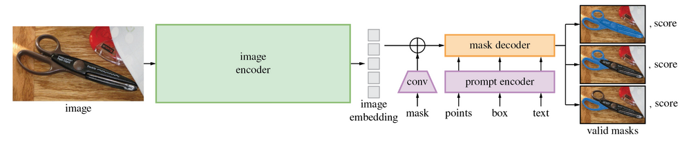

# SAM - Segment Anything Model

# What do you exactly mean By Segment Anything?

- The Segment Anything Model (SAM) is an instance segmentation model developed by Meta Research and released in April, 2023. Segment Anything was trained on 11 million images and 1.1 billion segmentation masks.

- Using Segment Anything, you can upload an image and:

1. Generate segmentation masks for all objects SAM can identify;
2. Provide points to guide SAM in generating a mask for a specific object in an image, or;
3. Provide a text prompt to retrieve masks that match the prompt (although this feature was not released at the time of writing).

- SAM has a wide range of use cases. For instance, you can use SAM:

1. As a zero-shot detection model, paired with an object detection model to assign labels to specific objects;
2. As an annotation assistant, a feature made available in the Roboflow Annotate platform, and;
3. Standalone to extract features from an image, too. For example, you could use SAM to remove backgrounds from images.

# Segment Anything Task:

- The Segment Anything authors set up a training task for their model that involves predicting a set of "valid masks" for a given prompt to the model.
- The prompt could be in the form of points (presumably from a live annotator) and target masks or a word using semantic features from CLIP.
- The other large benefit of having this task structure is that the model works well on zero-shot transfer at inference time when the model is being used to label masks in an image.

# Architecture:

- The Segment Anything model is broken down into two sections. The first is a featurization transformer block that takes and image and compresses it to a 256x64x64 feature matrix. 
- These features are then passed into a decoder head that also accepts the model's prompts, whether that be a rough mask, labeled points, or text prompt (note text prompting is not released with the rest of the model).

- The Segment model architecture is revolutionary because it puts the heavy lifting of image featurization to a transformer model and then trains a lighter model on top. 
- For deploying SAM to production, this makes for a really nice user experience where the featurization can be done via inference on a backend GPU and the smaller model can be run within the web browser.
- Segment Anything releases an open source dataset of 11MM images and over 1 billion masks, SA-1B Dataset, the largest mask corpus to date.

1. Assisted Manual: Annotators annotate alongside SAM to pick all masks in an image.
2. Semi-Automatic: Annotators are asked to only annotate masks for which SAM cannot render a confident prediction.
3. Full-Auto: SAM is allowed to fully predict masks given it's ability to sort out ambiguous masks via a full sweep.

# Conclusion:
- Segment Anything will certainly revolutionize the way that people label images for segmentation on the web.
- The SAM features as they have been demonstrated to be extremely powerful as an engine for zero-shot capabilities.
- Perhaps they will even be setting a SOTA on the COCO dataset for object detection with some supervision.
- One can train an extremely large transformer to featurize images well into a strong semantic space that can be used for downstream tasks. This is why many are calling Segment Anything a GPT-esque moment for computer vision.
