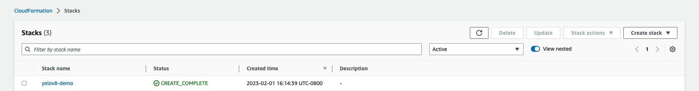

# Host a YOLOv8 model on a SageMaker Endpoint
This aim of this project is to host a YOLOv8 PyTorch model on a SageMaker Endpoint and test it by invoking the endpoint. The project utilizes AWS CloudFormation to build the stack and once that is created, it uses the SageMaker notebooks created in order to create the endpoint and test it.

## AWS Architecture:


## AWS CloudFormation Stack Creation
The AWS CloudFormation Stack can be created using 2 methods: (1) Using Template or (2) Using AWS CDK. Both the methods are described as follows:

1. Create Stack using AWS CloudFormation:
    - Choose **Launch Stack** and (if prompted) log into your AWS account:
    	- [Launch Stack](https://console.aws.amazon.com/cloudformation/home#/stacks/create/review?templateURL=https://aws-blogs-artifacts-public.s3.amazonaws.com/artifacts/ML-13353/yolov8-pytorch-cfn-template.yaml)
    - Select a unique Stack Name, ackowledge creation of IAM resources, create the stack and wait for a few minutes for it to be successfully deployed
        - 

2. PyTorch YOLOv8 model with AWS CDK
In order to create the stack with AWS CDK, follow the steps highlighted in [yolov8-pytorch-cdk](yolov8-pytorch-cdk/README.md). Use these steps:
```
$ cd yolov8-pytorch-cdk
$ python3 -m venv .venv
$ source .venv/bin/activate
$ pip3 install -r requirements.txt
$ cdk synth
$ cdk bootstrap
$ cdk deploy
```

## YOLOv8 PyTorch model deployment on Amazon SageMaker Endpoints:
- From AWS Console, go to Amazon SageMaker Notebook Instances
- Select the Notebook created by the stack and open it
- Inside SageMaker Notebook, navigate: `sm-notebook` and open the notebooks: `1_DeployEndpoint.ipynb` & `2_TestEndpoint.ipynb`
    1. `1_DeployEndpoint.ipynb`: Download YOLOv8 model, zip inference code and model to S3, create SageMaker endpoint and deploy it
    2. `2_TestEndpoint.ipynb`: Test the deployed endpoint by running an image and plotting output; Cleanup the endpoint and hosted model
